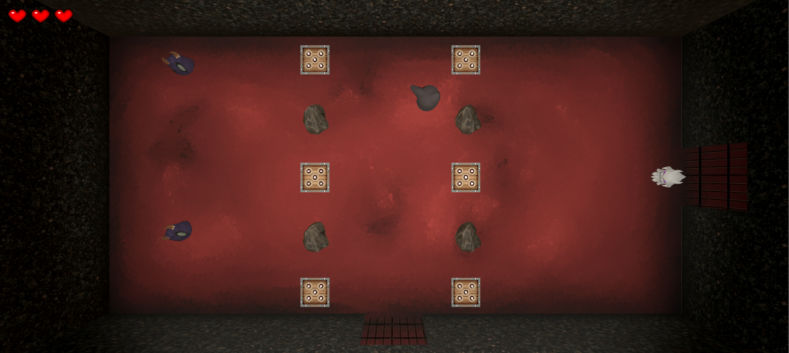
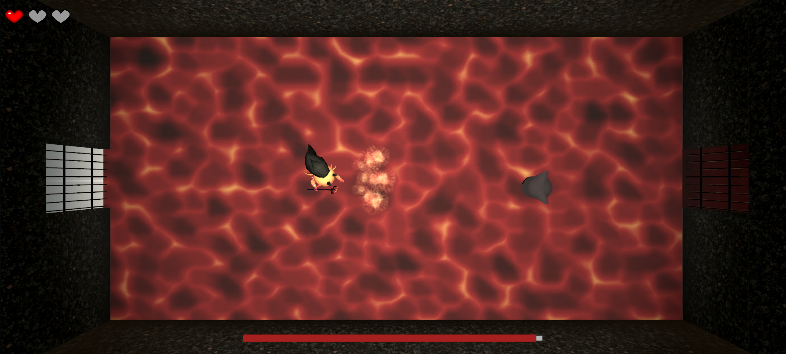

# Embody

Embody is an indie dungeon crawler inspired by the Binding of Isaac where you play as a ghost that can possess dead foes to gain their attacks and attributes. Created as a course project for CAP 4053 Artificial Intelligence for Games (University of Florida).

*Navigate rooms full of enemies, traps, and obstacles*

*Possess dead enemies*

*Meet your maker*

## Credits

### Models and art
- Ghost model: [Dominic Kett (Dommk / BlackSonicShadow)](https://www.cgtrader.com/free-3d-models/character/fantasy/ghost-11a024a0-ecbc-4b17-aa26-9cab5ce2e7b4)
- [Animated Torch by William Thompson](https://opengameart.org/content/lpc-animated-torch)
- Spike traps: [Dungeon Traps, Unity Asset Store](https://assetstore.unity.com/packages/3d/environments/dungeons/dungeon-traps-50655)
- Flame art and SFX: [Fire & Spell Effects by Digital Ruby, aka Jeff Johnson](https://assetstore.unity.com/packages/vfx/particles/fire-explosions/fire-spell-effects-36825)
- [Medieval fence pack by ARTTI](https://assetstore.unity.com/packages/3d/environments/medieval-fence-pack-11618)
- [Lava background/tiles by rh0](https://opengameart.org/content/lava-background-6-screen-resolutions)
- [Blood stone by mafon2](https://opengameart.org/content/seamless-space-rocks-textures-pack-512px-blood-stone-ch16png)
- [Mine rocks by mafon2](https://opengameart.org/content/seamless-space-rocks-textures-pack-512px-mine-rocks-ch16png)
- [Cubex enemy model by DimasAlclade](https://www.cgtrader.com/free-3d-models/various/various-models/cubex)
- [Rock model by GRUMPNTUG](https://assetstore.unity.com/packages/3d/free-demo-rock-53146)
- [Halo Shader and Prefab](https://hyunkell.com/blog/rts-style-unit-selection-in-unity-5/)
- Floor and Wall Textures by Jacqueline (Buddy) Llerena

### Audio

- [Ruines oubliées (menu theme) by Dogers](https://opengameart.org/content/ruines-oubli%C3%A9es)
- [Demon Lord soundtrack by Scrabbit](https://opengameart.org/content/demon-lord)
- [Interface Sounds Starter Pack by p0ss](https://opengameart.org/content/interface-sounds-starter-pack)
- [Menu Selection Click by NenadSimic](https://opengameart.org/content/menu-selection-click)
- [Melee sounds by remaxim](https://opengameart.org/content/3-melee-sounds)
- [Devil phase two audio by daf024](https://freesound.org/people/daf024/sounds/84615/)
- [Devil boss death audio titled Jesus Lastra - Cries From Hell](https://opengameart.org/content/dark-ambiance-cries-from-hell)
- [Door closing sound by qubodup](https://freesound.org/people/qubodup/sounds/159552/)
- [Spawning sound by pepingrillin](https://freesound.org/people/pepingrillin/sounds/252083/)
- [Dramatic Hit sound by qubodup](https://freesound.org/people/qubodup/sounds/222517/)
- Red heart consumption: [Water_Gulp by Q.K.](https://freesound.org/people/Q.K./sounds/56271/)
- Golden heart consumption: [Powerup/success by Gabriel Araujo](https://freesound.org/people/GabrielAraujo/sounds/242501/)
- [Game over audio by DRFX](https://freesound.org/people/DRFX/sounds/341807/)
- [Kat Laser fire - FX067.mp3](https://opengameart.org/content/sound-effects-sfx007)
- [Snake Death - Snake hiss, short -zapsplat_animals_snake_hiss_short_14693.mp3](https://www.zapsplat.com/?s=snake)
- [Cruz Triple Shot laser1.mp3](https://opengameart.org/content/63-digital-sound-effects-lasers-phasers-space-etc)
